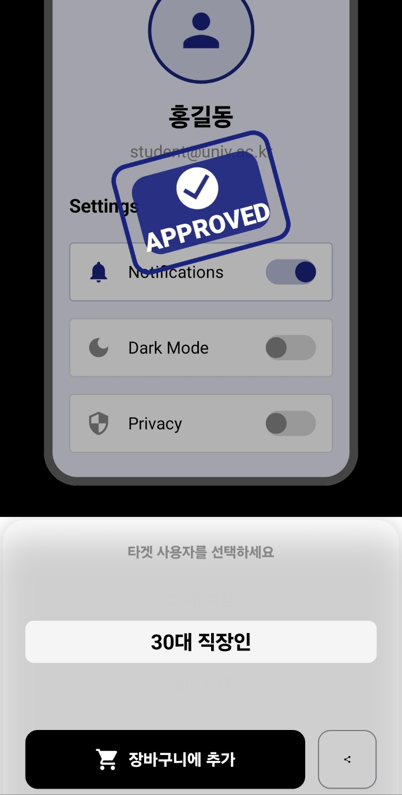

# ComposeMarket: Persona-Based Dynamic UI Engine

[Korean Version](README_ko.md)


> **"Don't Code UI. Just Shop It."**
>
> **An Android rendering engine where the UI dynamically changes in real-time at runtime, tailored to the target user (Persona).**

---

## 📖 Introduction

**ComposeMarket** is an **Android UI Marketplace & Rendering Engine** designed to dramatically reduce the cost of UI modification and communication overhead between developers and non-developers (planners, designers).

It eliminates the inefficient loop of **[Planning → Development → Build → Review]**. Instead, it is a solution that accelerates the development process by allowing users to **Select (Shop)** UI styles optimized for the target user (Persona) in real-time and immediately **Export** the validated results.

### 💡 Core Problem & Solution

*   **Core Problem**: Developers must constantly modify and rebuild code to reflect abstract requirements such as "make it feel a bit softer" or "target the MZ generation."
*   **Solution**: **ComposeMarket** injects UI properties (Color, Typography, Shape) at runtime immediately upon selecting a defined persona (e.g., teenagers, 30s office workers) and renders the screen without requiring an app restart.

---

## 📸 Key Features & Demo

### 1. Persona-Based Real-time Rendering
The **Dynamic Theming Engine** operates immediately upon selecting the target audience, redrawing the UI instantly.

| Full Demonstration (Workflow) | JSON Rendering and Export |
|:---:|:---:|
|  |  |

### 2. Time Machine (State Management) & Export
UI change history is managed like Git, and finalized designs are extracted as JSON and PDF specifications.

| Style JSON Export | Time Machine (State Restoration) |
|:---:|:---:|
|  |  |

*   **One-Click Export**: Copies the current screen's style information to the clipboard as lightweight JSON.
*   **PDF Report**: Generates a final approval report combining the screen snapshot (Bitmap) and style information (JSON).

---

## 📱 Persona-Based Rendering Examples

These results are rendered using the exact same layout code, only with the **Style Config** swapped.

| 10s Student (Login) | 20s Woman (Recording) | 30s Office Worker (Profile) | 30s Office Worker (Final Approval) |
|:---:|:---:|:---:|:---:|
|  |  |  |  |
---

## 🏗️ Architecture & Tech Stack

We adhered to the **MVVM Architecture** and applied **Data-Driven UI** design, considering scalability and maintainability.

### Tech Stack

| Category | Technology | Description |
| --- | --- | --- |
| **Language** | Kotlin 100% | |
| **UI Framework** | Jetpack Compose | Declarative UI, utilizes State-based Recomposition |
| **Architecture** | MVVM + Clean Arch | Separation of UI, Domain, and Data Layers |
| **DI** | Hilt | Reduces coupling between components and handles dependency injection |
| **Data** | Gson | JSON parsing and style data serialization |

### System Design
*   **Dynamic Theming Engine**: A flexible structure that draws components by injecting a `UiStyleConfig` object instead of hardcoded resources.
*   **Repository Pattern**:
    *   Abstracts and separates data sources from UI logic.
    *   **MVP Implementation**: The current version uses **Local Data Source (Pre-defined JSON Presets)** for quick demonstration and offline stability. It is designed to be replaceable with a Remote Data Source later without code changes.
*   **Offline First**: Provides a zero-latency UX by operating solely with the internal engine without server communication.

---

## 🔧 Core Technical Challenges

The most critical technical challenge addressed in this project was **"verifying the consistency of dynamically changing UI."**

### 🎯 Challenge: Static Proof of Dynamic Results (Atomic Snapshot)
A pipeline was needed to bind the real-time changing Compose UI screen and its configuration JSON into a **reliable PDF report**.

1.  **Problem**: Compose's Recomposition happens asynchronously. Simply capturing the screen could result in saving an image before the UI update was complete, or a mismatch between the data and the image.
2.  **Solution (Atomic Snapshot)**:
    *   We analyzed Compose's `OnGloballyPositioned` and the rendering pipeline to implement logic that detects the precise moment when the **Layout and Drawing phases are completely finished**.
    *   This ensures an **atomic snapshot** feature, guaranteeing that "this bitmap (result) was created exactly with this JSON (configuration)."

---

## 🛠️ Getting Started

**Requirements**
*   Android Studio Ladybug (2024.2.1) or later
*   JDK 17 or later
*   minSdk 30 / targetSdk 35

**Installation and Execution**
```bash
# 1. Clone the project
git clone https://github.com/largeblueberry/ComposeBridge.git

# 2. Open and Sync the project
# In Android Studio, select 'Open' -> choose the cloned folder

# 3. Run (app module)
# Execute on an emulator or physical device
```

---

## 🔮 Future Roadmap

ComposeMarket aims to expand beyond a simple Android app to become a **universal UI protocol connecting non-developers and developers.**

*   **Universal UI Protocol (Standardization)**:
    *   Defining a **standardized UI JSON schema** usable across all declarative UI frameworks, including Android (Compose), iOS (SwiftUI), and Web (React).
    *   Building an ecosystem where "a single JSON specification manages the design of all platforms."
*   **Cross-Platform Engines**:
    *   **Web Expansion**: Developing a JavaScript/TypeScript-based rendering engine to support real-time style changes in the web environment.
    *   **iOS Support**: Implementing an additional SwiftUI-based rendering engine.
*   **Design Ops for Teams**:
    *   Evolving into a **'Serverless UI Handoff'** tool for SI agencies or early-stage startups.
    *   Providing a **Lean Process** solution that allows immediate deployment and verification of planning/design changes through simple local JSON file exchange, without complex server setup (SDUI).

---

## 📚 References

*   **Project History**: This project is based on the knowledge and architecture gained while developing the developer's graduation project, [AiCompose](https://github.com/largeblueberry/AiCompose.git).
*   **Android Developers**: [Architecture Guide](https://developer.android.com/topic/architecture), [Compose Theming](https://developer.android.com/jetpack/compose/designsystems/material3)
*   Development was guided by studying Compose and Android architecture through the official documentation above.

---

## 📄 License

Copyright 2025 largeblueberry.
Distributed under the **Apache License 2.0**. See `LICENSE` for more information.