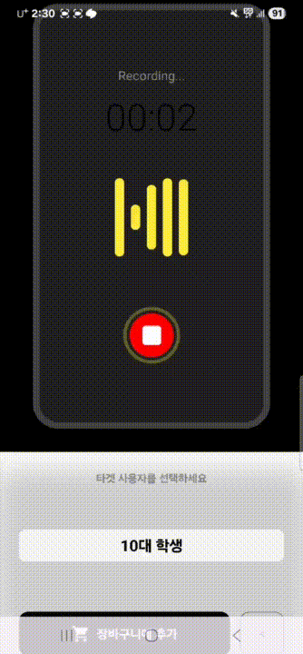
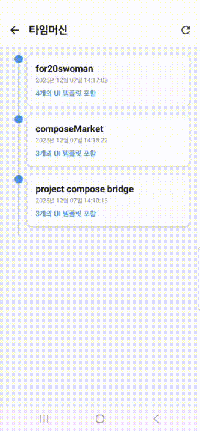
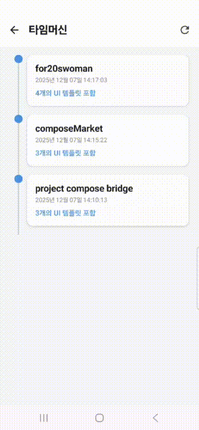
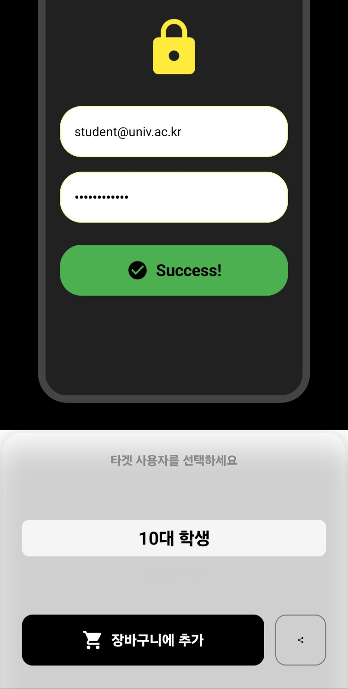
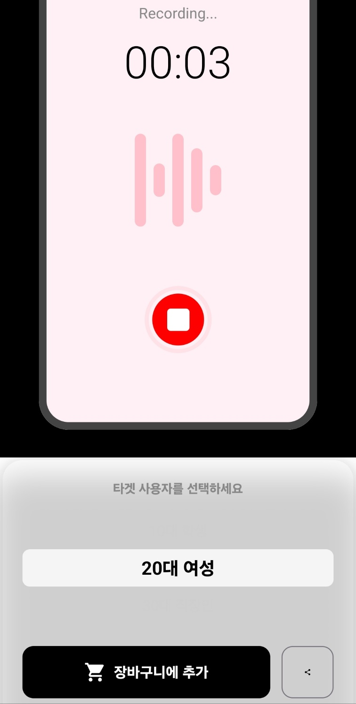
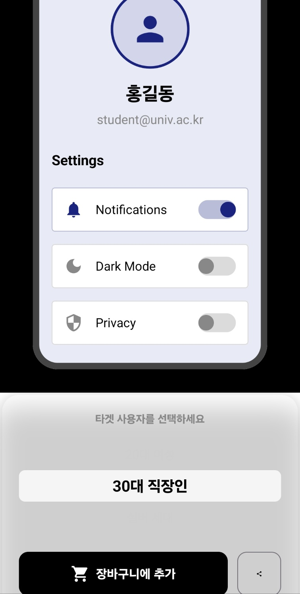

# ComposeMarket: Persona-Based Dynamic UI Engine

[English Version](README.md)


> **"Don't Code UI. Just Shop It."**
>
> **타겟 사용자(Persona)에 맞춰 런타임에 UI가 실시간으로 변환되는 안드로이드 렌더링 엔진**

---

## 📖 프로젝트 소개 (Introduction)

**ComposeMarket**은 개발자와 비개발자(기획자, 디자이너) 간의 UI 수정 및 커뮤니케이션 비용을 획기적으로 줄이기 위해 설계된 **Android UI Marketplace & Rendering Engine**입니다.

기존의 **[기획 → 개발 → 빌드 → 확인]**이라는 비효율적인 루프를 제거합니다. 대신, 타겟 사용자(Persona)에 최적화된 UI 스타일을 실시간으로 **선택(Shopping)**하고, 검증된 결과물을 즉시 **내보내기(Export)**하여 개발 프로세스를 단축시키는 솔루션입니다.

### 💡 핵심 문제 해결 (Problem & Solution)

*   **핵심 문제점**: "조금 더 부드러운 느낌으로", "MZ세대 타겟으로"와 같은 추상적인 요구사항을 반영하기 위해 개발자는 매번 코드를 수정하고 빌드해야 합니다.
*   **해결 방안**: **ComposeMarket**은 정의된 페르소나(10대, 30대 직장인 등)를 선택하는 즉시, 앱 재실행 없이 **런타임에 UI 속성(Color, Typography, Shape)을 주입**하여 화면을 렌더링합니다.

---

## 📸 주요 기능 및 데모 (Key Features & Demo)

### 1. Persona-Based Real-time Rendering
타겟층을 선택하면 **Dynamic Theming Engine**이 작동하여 즉시 UI를 다시 그립니다.

| 전체 시연 (Workflow) | JSON 렌더링 및 내보내기 |
|:---:|:---:|
|  |  |

### 2. Time Machine (State Management) & Export
UI 변경 이력을 Git처럼 관리하며, 확정된 디자인은 JSON 및 PDF 명세서로 추출됩니다.

| 스타일 JSON 내보내기 | 타임머신 (상태 복원) |
|:---:|:---:|
|  |  |

*   **One-Click Export**: 현재 화면의 스타일 정보를 경량화된 JSON으로 클립보드에 복사.
*   **PDF Report**: 화면 스냅샷(Bitmap)과 스타일 정보(JSON)가 결합된 최종 승인 보고서 생성.

---

## 📱 페르소나별 렌더링 예시 (Persona Preview)

동일한 레이아웃 코드에 **Style Config**만 교체하여 렌더링된 결과입니다.

| 10대 학생 (로그인) | 20대 여성 (녹음) | 30대 직장인 (프로필) |
|:---:|:---:|:---:|
|  |  |  |

---

## 🏗️ 아키텍처 및 기술 스택 (Architecture)

확장성과 유지보수성을 고려하여 **MVVM Architecture** 를 준수하였으며, **Data-Driven UI** 설계를 적용했습니다.

### Tech Stack

| Category | Technology | Description |
| --- | --- | --- |
| **Language** | Kotlin 100% | |
| **UI Framework** | Jetpack Compose | 선언형 UI, State 기반 Recomposition 활용 |
| **Architecture** | MVVM + Clean Arch | UI, Domain, Data Layer의 분리 |
| **DI** | Hilt | 컴포넌트 간 결합도 감소 및 의존성 주입 |
| **Data** | Gson | JSON 파싱 및 스타일 데이터 직렬화 |

### System Design
*   **Dynamic Theming Engine**: 하드코딩된 리소스 대신 `UiStyleConfig` 객체를 주입받아 컴포넌트를 그리는 유연한 구조.
*   **Repository Pattern**:
    *   데이터 소스와 UI 로직을 추상화하여 분리했습니다.
    *   **MVP Implementation**: 현재 버전은 빠른 시연과 오프라인 안정성을 위해 **Local Data Source(Pre-defined JSON Presets)**를 사용합니다. 추후 코드 변경 없이 Remote Data Source로 교체 가능하도록 설계되었습니다.
*   **Offline First**: 서버 통신 없이 내부 엔진만으로 동작하여 지연 시간 없는(Zero-latency) UX 제공.

---

## 🔧 핵심 기술적 챌린지 (Technical Challenges)

본 프로젝트에서 가장 중요하게 다룬 기술적 난제는 **"동적으로 변하는 UI의 정합성 검증"**이었습니다.

### 🎯 Challenge: 동적 결과의 정적 증명 (Atomic Snapshot)
실시간으로 변경되는 Compose UI 화면과 그 설정을 담은 JSON을 묶어 **신뢰할 수 있는 PDF 보고서**로 만드는 파이프라인 구축이 필요했습니다.

1.  **문제점**: Compose의 Recomposition은 비동기적으로 일어납니다. 단순히 화면을 캡처하면 UI 업데이트가 완료되지 않은 시점의 이미지가 저장되거나, 데이터와 이미지가 불일치하는 문제가 발생했습니다.
2.  **해결책 (Atomic Snapshot)**:
    *   Compose의 `OnGloballyPositioned` 및 렌더링 파이프라인을 분석하여, **Layout 및 Drawing 단계가 완전히 끝난 시점**을 감지하는 로직을 구현했습니다.
    *   이를 통해 "이 비트맵(결과물)은 정확히 이 JSON(설정)으로 만들어졌다"는 것을 보장하는 **원자적 스냅샷** 기능을 완성했습니다.

---

## 🛠️ 시작하기 (Getting Started)

**요구 사항**
*   Android Studio Ladybug (2024.2.1) 이상
*   JDK 17 이상
*   minSdk 30 / targetSdk 35

**설치 및 실행**
```bash
# 1. 프로젝트 클론
git clone https://github.com/largeblueberry/ComposeBridge.git

# 2. 프로젝트 열기 및 Sync
# Android Studio에서 'Open' -> 해당 폴더 선택

# 3. 실행 (app 모듈)
# 에뮬레이터 또는 실기기에서 실행
```

---

## 🔮 향후 로드맵 (Future Roadmap)

*   **Remote Style Repository**: 현재의 로컬 프리셋 방식을 넘어, 서버 API를 통해 실시간으로 스타일을 배포하고 업데이트하는 기능.
*   **Component Injection**: 색상/스타일 변경을 넘어, 버튼 모양이나 레이아웃 구조까지 JSON으로 제어하는 'Server Driven UI' 형태로 발전.
*   **Advanced Time Machine**: Git의 복잡한 기능을 시각적인 타임라인 UI로 구현하여 비개발자 친화적인 버전 관리 제공.

---

## 📚 참고 자료 (References)

*   **Project History**: 본 프로젝트는 개발자의 졸업작품 [AiCompose](https://github.com/largeblueberry/AiCompose.git)를 개발하면서 얻은 지식과 아키텍쳐를 기반으로 개발했습니다.
*   **Android Developers**: [Architecture Guide](https://developer.android.com/topic/architecture), [Compose Theming](https://developer.android.com/jetpack/compose/designsystems/material3)
*   위의 공식문서를 읽으면서 Compose 및 Android 아키텍처를 공부하며 개발했습니다.

---

## 📄 라이선스 (License)

Copyright 2025 largeblueberry.
Distributed under the **Apache License 2.0**. See `LICENSE` for more information.